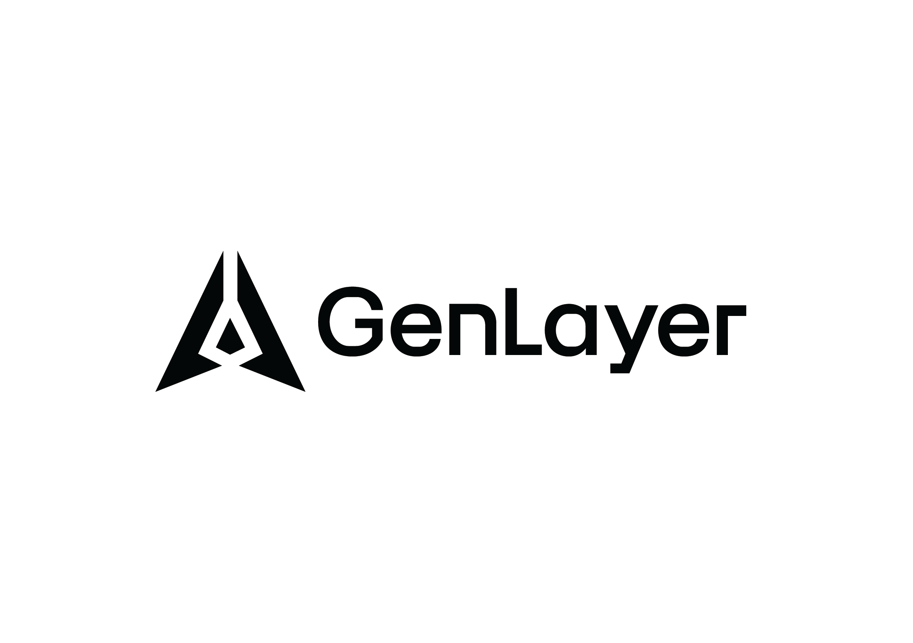

<p align="center">
  
</p>

<h1 align="center">GenLayer TypeRace</h1>

<p align="center">A multiplayer typing race about GenLayer</p>

<p align="center">
  <a href="https://genlayer-typerace-production.up.railway.app"><b>Play it</b></a>
</p>

<p align="center">
  
  
  
  
</p>

## About

Type a passage and a car moves across a track above the text, driven by how fast and how
accurately you type

- **Three tiers** Genesis, Consensus and Byzantine, from plain language up to Intelligent Contract code
- **Two modes** first past the finish line, or the most correct words in 60 seconds
- **Solo practice** against a ghost car running at your own best pace
- **Live races** in hosted rooms with an invite link, a lobby and a countdown
- **On screen keyboard** under the passage, lighting the next key you need
- **Leaderboard** that remembers your name and keeps your records

Sign in is just a name, with no password, no wallet and nothing to connect

## Stack

A Vite and React client with an Express, Socket.IO and SQLite server in one workspace

Race timing and scoring are server authoritative, and positions are pushed to every player ten
times a second

## Run it

```bash
npm install
cp .env.example server/.env
npm run dev
```

[`.env.example`](.env.example) lists every setting the server reads

## Scripts

| Command | |
|---|---|
| `npm run dev` | Client and API together |
| `npm run build` | Build both |
| `npm start` | Production server |
| `node scripts/race-smoke-test.mjs` | Full two player race against a running server |
| `node scripts/seed-demo.mjs` | Fill an empty leaderboard with sample players |

## Credits

Built by [@Hellishnum1](https://x.com/Hellishnum1)

An unofficial community project. GenLayer and its brand assets belong to
[GenLayer](https://genlayer.com)

MIT, see [LICENSE](LICENSE)
